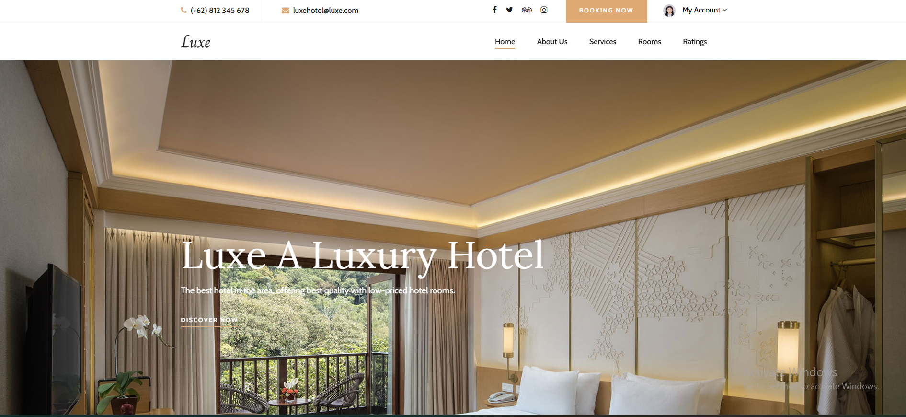
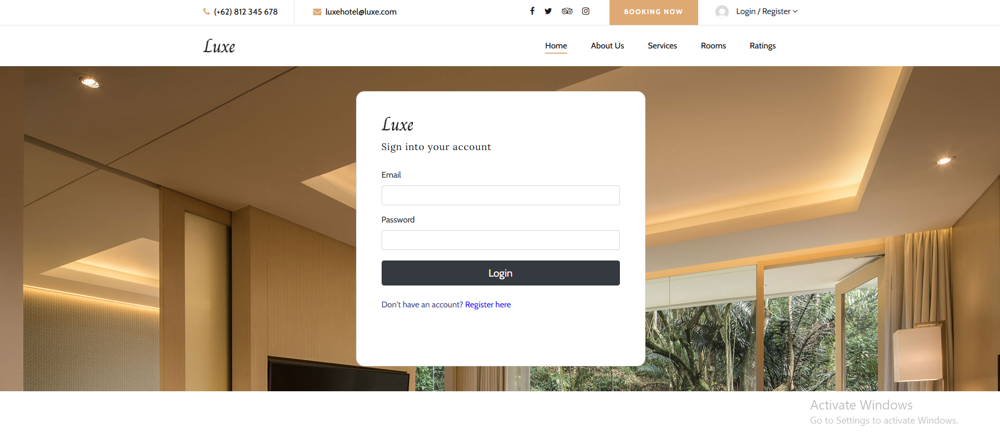
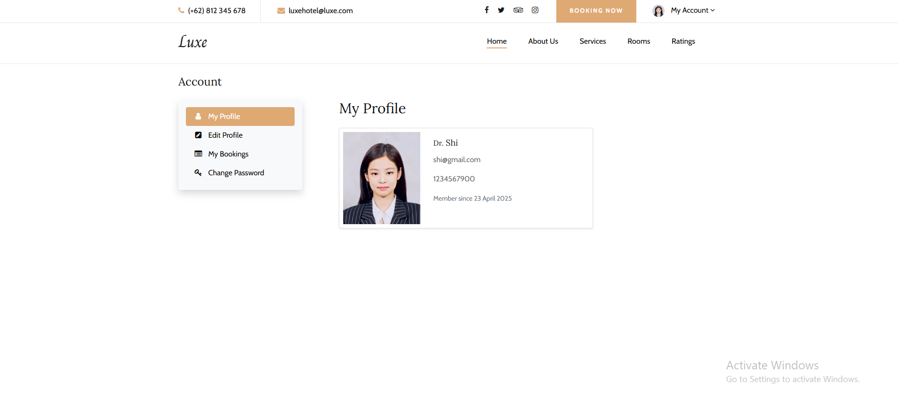
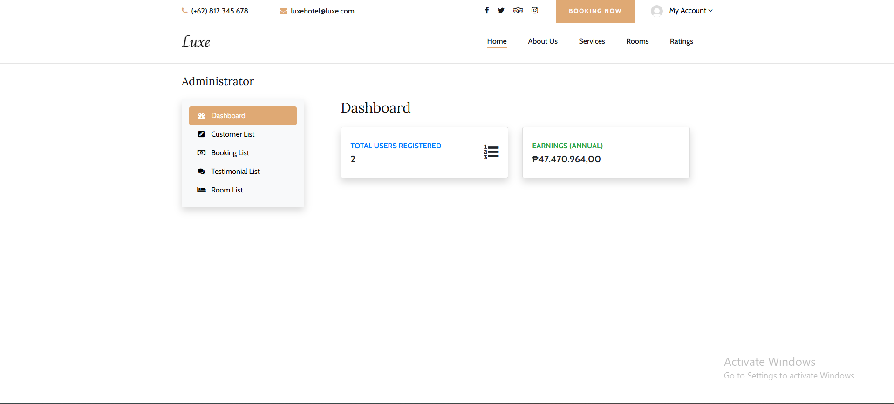
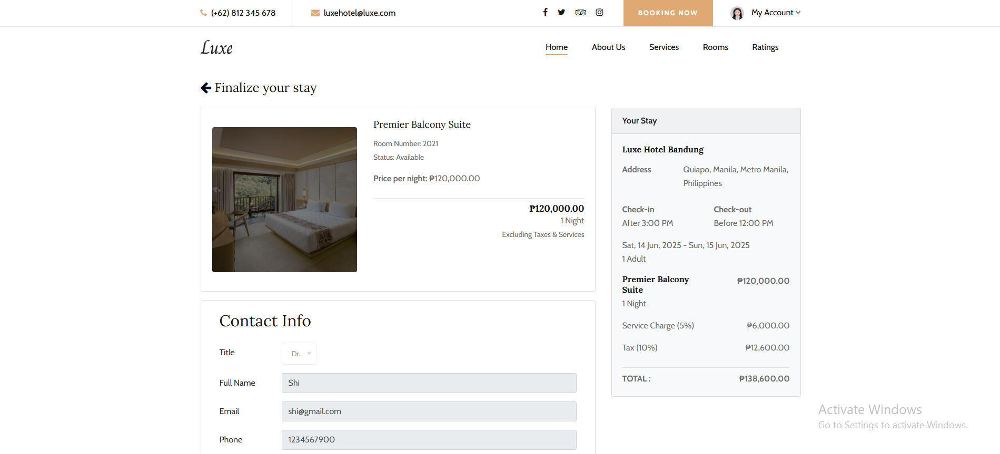
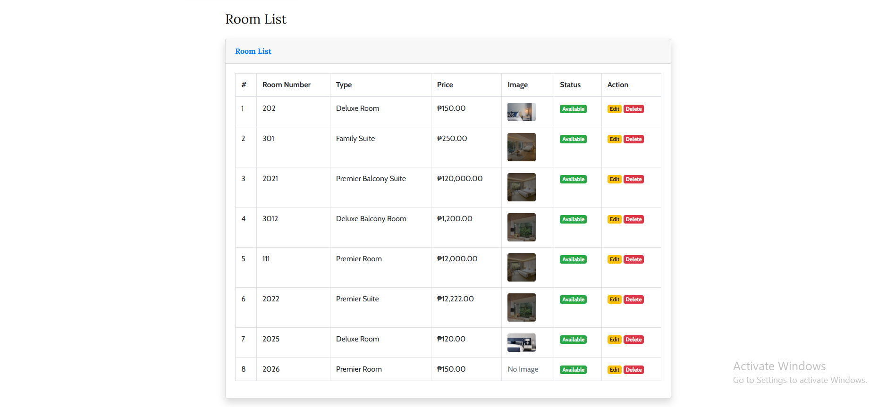

# LuxeHotel Web Application

## Project Overview

**LuxeHotel** is a modern hotel management web application that allows users to register, book rooms, and manage their bookings, while administrators can manage rooms, bookings, and users. The system features secure authentication, role-based access, RESTful APIs, secure file uploads, CSRF protection, and a responsive Bootstrap interface.

---

## Features

- User registration and login with session management
- Role-based access control (Admin/User)
- RESTful API endpoints for rooms and bookings
- Secure file upload for profile and room images
- CSRF protection and input validation
- Modern, responsive UI using Bootstrap

---

## Installation & Setup

1. **Clone the Repository**
   ```bash
   git clone https://github.com/yourusername/LuxeHotel.git
   ```

2. **Move the Project to XAMPP**
   - Place the `LuxeHotel` folder inside your `C:/xampp/htdocs/` directory.

3. **Import the Database**
   - Open [phpMyAdmin](http://localhost/phpmyadmin)
   - Create a new database (e.g., `luxe_hotel`)
   - Import the provided SQL file (e.g., `db_dpw.sql`) into this database

4. **Configure Database Connection**
   - Open `application/config/database.php`
   - Set your database name, username, and password:
     ```php
     $db['default']['hostname'] = 'localhost';
     $db['default']['username'] = 'root';
     $db['default']['password'] = '';
     $db['default']['database'] = 'luxe_hotel';
     ```

5. **Set Base URL**
   - Open `application/config/config.php`
   - Set:
     ```php
     $config['base_url'] = 'http://localhost/LuxeHotel/';
     ```

6. **Start XAMPP**
   - Start Apache and MySQL from the XAMPP Control Panel

7. **Access the Application**
   - Open [http://localhost/LuxeHotel/](http://localhost/LuxeHotel/) in your browser

---

## Usage

- **User Registration:**  
  Go to `/auth/registration` to create a new user account.
- **User Login:**  
  Go to `/auth` to log in.
- **Admin Login:**  
  Use an admin account to access the admin dashboard and management features.
- **Book a Room:**  
  Browse available rooms and book as a logged-in user.
- **Manage Bookings:**  
  Users can view their bookings; admins can manage all bookings.
- **File Uploads:**  
  Users and admins can upload profile and room images with validation.

---

## API Endpoints

| Endpoint                | Method | Description                |
|-------------------------|--------|----------------------------|
| `/api/rooms`            | GET    | List all rooms             |
| `/api/rooms`            | POST   | Create a new room (admin)  |
| `/api/rooms/{id}`       | GET    | Get room by ID             |
| `/api/rooms/{id}`       | PUT    | Update room (admin)        |
| `/api/rooms/{id}`       | DELETE | Delete room (admin)        |
| `/api/bookings`         | GET    | List all bookings          |
| `/api/bookings`         | POST   | Create a new booking       |
| `/api/bookings/{id}`    | GET    | Get booking by ID          |
| `/api/bookings/{id}`    | PUT    | Update booking (admin)     |
| `/api/bookings/{id}`    | DELETE | Delete booking (admin)     |

---

## Security Practices

- **CSRF Protection:** All forms and API endpoints are protected using CodeIgniter's CSRF token system.
- **Input Validation:** All user input is validated and sanitized.
- **File Upload Security:** Only allowed file types and sizes are accepted; filenames are encrypted.
- **Session Management:** Secure session handling for authentication and role-based access.

---

## Troubleshooting

- **Database Errors:**  
  Ensure the database is imported and connection settings are correct.
- **404 Errors:**  
  Check that the base URL and project folder are set up correctly.
- **File Upload Issues:**  
  Ensure the `assets/img/profile/` and `assets/img/room/` folders are writable.

---

## Credits

Developed by:
- Macadato, Jehadee
- Maquiling, Kurt Russel
- Amplayo, Vladimir D.
- Bacurnay, Khen G.
- Heredero, Moses Jr.

For educational purposes.

---

## Example Screenshots

### Landing Page


### Login Page


### User Dashboard


### Admin Dashboard


### Booking Page


### Room Management (Admin)


> _Place your screenshot images in a `screenshots/` folder in the project root. Update the image filenames as needed to match your actual screenshots._
